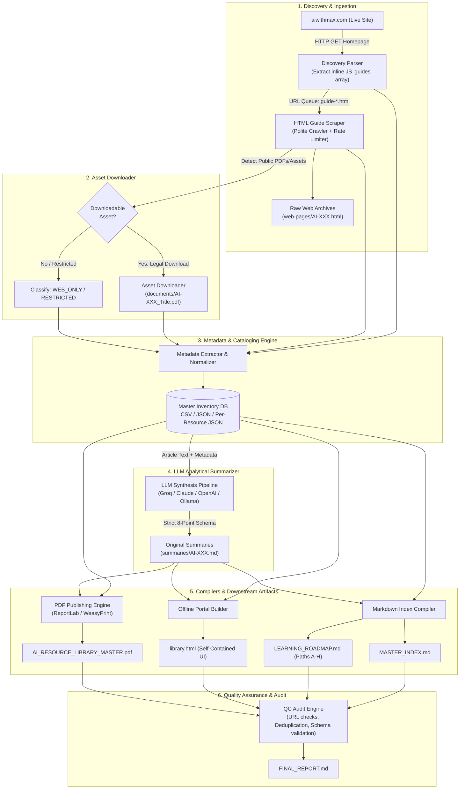

# Architecture: Systematic Personal AI Resource Library

> **Target Source:** [https://aiwithmax.com/](https://aiwithmax.com/)  
> **Source Reference:** [`docs/problemStatement.md`](file:///Users/mna/AI-Resource-Library/docs/problemStatement.md)  
> **Version:** 1.0.0  
> **Status:** Approved Architecture Specification  

---

## Table of Contents

1. [Architectural Overview & System Vision](#1-architectural-overview--system-vision)
2. [High-Level System Architecture Diagram](#2-high-level-system-architecture-diagram)
3. [Technology Stack & Decisions](#3-technology-stack--decisions)
4. [Component Decomposition & Subsystems](#4-component-decomposition--subsystems)
   - [4.1 Ingestion & Discovery Subsystem](#41-ingestion--discovery-subsystem)
   - [4.2 Asset Downloader & Storage Subsystem](#42-asset-downloader--storage-subsystem)
   - [4.3 Metadata & Cataloging Engine](#43-metadata--cataloging-engine)
   - [4.4 LLM Analytical Summarizer & Copyright Guard](#44-llm-analytical-summarizer--copyright-guard)
   - [4.5 Markdown & Roadmap Compiler](#45-markdown--roadmap-compiler)
   - [4.6 Offline Master PDF Compilation Engine](#46-offline-master-pdf-compilation-engine)
   - [4.7 Searchable Offline Web Portal (`library.html`)](#47-searchable-offline-web-portal-libraryhtml)
   - [4.8 Quality Control & Audit Engine](#48-quality-control--audit-engine)
5. [Data Flow Architecture](#5-data-flow-architecture)
6. [Data Schema & Persistence Models](#6-data-schema--persistence-models)
7. [Prompt Engineering & Anti-Plagiarism Guardrails](#7-prompt-engineering--anti-plagiarism-guardrails)
8. [Project Directory & File Structure](#8-project-directory--file-structure)
9. [Error Handling, Edge Cases & Resilience Strategy](#9-error-handling--edge-cases--resilience-strategy)
10. [Human Escalation Protocol](#10-human-escalation-protocol)
11. [Execution Sequence & Verification Gates](#11-execution-sequence--verification-gates)

---

## 1. Architectural Overview & System Vision

The **Systematic Personal AI Resource Library** is an end-to-end automated pipeline designed to harvest, structure, analyze, and package educational AI resources from [aiwithmax.com](https://aiwithmax.com/) into a permanent, self-contained, offline-first personal knowledge system.

### Core Architectural Principles

1. **Strict Copyright & Legal Compliance (Fair Use / Personal Reference):**
   - Never scrape or republish verbatim copyrighted text.
   - Only legally downloadable attachments (PDFs/cheatsheets) are downloaded.
   - Full-text web articles are processed in-memory to extract structured metadata and synthesize original analytical summaries.
   - For restricted or copyrighted content, canonical source URLs and metadata are cataloged with clear attribution notices.
2. **Offline-First & Self-Contained:**
   - The generated outputs—including `library.html`, `AI_RESOURCE_LIBRARY_MASTER.pdf`, `MASTER_INDEX.md`, and `LEARNING_ROADMAP.md`—must function with zero internet connection once compiled.
   - Zero external CDN dependencies for CSS, JS, or fonts in the offline web viewer.
3. **Idempotence & Resume Capability:**
   - Every stage of the pipeline caches intermediate results (discovery index, raw HTML, extracted metadata, generated summaries).
   - If execution halts due to network failure, rate limits, or human review, it can resume without re-running completed work or duplicating LLM API expenses.
4. **Deterministic Structured Schemas:**
   - All catalog entries are validated using strongly-typed Pydantic models before being written to disk or compiled into downstream artifacts.

---

## 2. High-Level System Architecture Diagram



---

## 3. Technology Stack & Decisions

| Layer / Role | Selected Technology | Alternative Evaluated | Rationale for Selection |
|---|---|---|---|
| **Programming Language** | Python 3.11+ | Node.js / TypeScript | Superior ecosystem for web scraping, text parsing, LLM integration, and document generation (ReportLab/WeasyPrint). |
| **HTTP & Crawling** | `httpx` + `BeautifulSoup4` | `playwright` / `selenium` | Ground-truth analysis shows `aiwithmax.com` embeds its full 65-guide catalog statically in HTML/JS. Headless browser overhead is unnecessary. `httpx` provides async speed, connection pooling, and polite throttling. |
| **Data Validation & Modeling** | `pydantic` v2 | Plain Dataclasses | Strict type checking, auto-coercion, robust serialization to JSON/CSV, and schema validation. |
| **LLM Summarization Engine** | `groq` / `anthropic` / `openai` with fallback | Local Ollama only | High throughput, strict JSON/Markdown formatting, low cost, with pluggable client architecture allowing local LLM fallback. |
| **Document Generation (PDF)** | `ReportLab` | `WeasyPrint` / `pandoc` | Highly customizable canvas control, crisp vector rendering, precise page budgeting, dynamic running headers/footers, and native table-of-contents bookmarks without heavy C-library dependencies. |
| **Offline Web Portal** | Vanilla HTML5 + CSS3 + Vanilla JS | React / Vue / Vite | True zero-dependency offline experience. Double-clickable in any browser (`file://`), instant loading, no build steps or local node server required. |
| **Data Storage / Indexing** | Local JSON, CSV & Markdown | SQLite / PostgreSQL | Keeps the repository lightweight, portable, version-controllable in git, and human-readable without running database daemons. |

---

## 4. Component Decomposition & Subsystems

```
┌────────────────────────────────────────────────────────────────────────────────────────┐
│                               AI-RESOURCE-LIBRARY PIPELINE                             │
├───────────────────────┬────────────────────────┬───────────────────────────────────────┤
│ INGESTION & ASSETS    │ ENRICHMENT & CATALOG   │ PUBLISHING & AUDIT                    │
│ • SiteCrawler         │ • MetadataEngine       │ • MarkdownCompiler (Index & Roadmaps) │
│ • GuideParser         │ • LLMSummarizer        │ • PDFGenerator (Master Book)          │
│ • AssetDownloader     │ • CopyrightGuard       │ • OfflinePortalBuilder (library.html) │
│ • RateLimiter         │ • InventoryWriter      │ • QCAuditor (Final Report)            │
└───────────────────────┴────────────────────────┴───────────────────────────────────────┘
```

### 4.1 Ingestion & Discovery Subsystem
- **Module:** `src/ingestion/crawler.py`, `src/ingestion/parser.py`
- **Responsibilities:**
  - Retrieve the root landing page `https://aiwithmax.com/`.
  - Extract the embedded `guides = [...]` JSON array containing IDs, titles, categories, difficulties, and descriptions.
  - Parse each individual guide page (`https://aiwithmax.com/guide-{id}.html`).
  - Extract the author avatar, name, table of contents, headings, external tool links, and clean article body text.
  - Rate-limit requests (1 request per second default, random jitter 0.2–0.5s) to ensure zero denial-of-service or bot alarms.
  - Store raw HTML files in `web-pages/AI-XXX_{id}.html` for auditability and offline reproduction.

### 4.2 Asset Downloader & Storage Subsystem
- **Module:** `src/ingestion/downloader.py`
- **Responsibilities:**
  - Inspect guide pages for public downloadable resources (e.g., PDFs, templates, cheat sheets, code zips).
  - Verify download headers (Content-Type, Content-Disposition, file size limits).
  - Sanitize filenames to standardized pattern: `documents/AI-XXX_SanitizedTitle.pdf`.
  - If no downloadable asset is available or content is paywalled/restricted, record status flags (`WEB_ONLY`, `RESTRICTED`) without breaking the pipeline.

### 4.3 Metadata & Cataloging Engine
- **Module:** `src/catalog/inventory.py`, `src/catalog/models.py`
- **Responsibilities:**
  - Assign deterministic, sequential unique identifiers: `AI-001`, `AI-002`, ..., `AI-065`.
  - Normalize categories into standardized taxonomies:
    1. *Getting Started*
    2. *Claude Code*
    3. *Tools & Integrations*
    4. *Prompts & Skills*
    5. *Building & Monetising*
    6. *AI Automation*
    7. *AI Agents*
    8. *AI Business*
    9. *AI Coding*
    10. *AI Marketing*
    11. *AI Productivity*
  - Persist records across three primary outputs:
    1. `inventory/master_inventory.csv`: Tabular spreadsheet for Excel/Sheets analysis.
    2. `inventory/master_inventory.json`: Consolidated machine-readable dataset.
    3. `metadata/AI-XXX.json`: Individual per-resource detailed metadata.

### 4.4 LLM Analytical Summarizer & Copyright Guard
- **Module:** `src/summarizer/llm_client.py`, `src/summarizer/prompt_templates.py`, `src/summarizer/synthesizer.py`
- **Responsibilities:**
  - Ingest extracted guide text and structured metadata.
  - Enforce the **Anti-Plagiarism / Fair-Use Prompt Guardrail**:
    - Prohibition against quoting verbatim text beyond brief title/term names.
    - Transformation of instructions into structured analytical knowledge points.
  - Synthesize original summaries matching the mandatory 8-section template:
    1. *What This Resource Teaches*
    2. *Why It Matters*
    3. *Target Audience*
    4. *Key Concepts & Principles*
    5. *Tools & Technologies Mentioned*
    6. *Practical Use Cases & Workflows*
    7. *Prerequisites*
    8. *Recommended Next Resources*
  - Output files to `summaries/AI-XXX.md`.
  - Implement cache check: if `summaries/AI-XXX.md` exists and is valid, skip re-generation.

### 4.5 Markdown & Roadmap Compiler
- **Module:** `src/generators/index_generator.py`, `src/generators/roadmap_generator.py`
- **Responsibilities:**
  - **`MASTER_INDEX.md`**:
    - Group resources by category with hierarchical numbering.
    - Generate summary tables linking to local documents, summaries, and source URLs.
  - **`LEARNING_ROADMAP.md`**:
    - Construct structured learning paths (Paths A through H) based on logical skill dependencies:
      - **Path A:** Complete Beginner
      - **Path B:** AI Power User
      - **Path C:** Claude Code Specialist
      - **Path D:** AI Automation Engineer
      - **Path E:** AI Agency / Freelancer
      - **Path F:** AI Startup Builder
      - **Path G:** AI Developer
      - **Path H:** AI Business & Monetisation
    - Sequence each path through 5 progressive milestones:
      $$\text{START HERE} \longrightarrow \text{NEXT} \longrightarrow \text{INTERMEDIATE} \longrightarrow \text{ADVANCED} \longrightarrow \text{CAPSTONE PROJECT}$$

### 4.6 Offline Master PDF Compilation Engine
- **Module:** `src/generators/pdf_engine.py`, `src/generators/pdf_styles.py`
- **Responsibilities:**
  - Generate `pdf/AI_RESOURCE_LIBRARY_MASTER.pdf`.
  - Incorporate professional book architecture:
    - **Cover Page:** Clean typography, minimalist accent layout, metadata date/version.
    - **Front Matter:** Executive notice, copyright disclaimers, guide on using the book.
    - **Table of Contents:** Two-level clickable PDF bookmark hierarchy.
    - **Roadmaps Visual Section:** Formatted learning paths with milestone blocks.
    - **Categorized Directory:** Summary listings by category.
    - **Resource Profiles:** Two-column or structured card layout per resource detailing learning objectives, concepts, tools, prerequisites, personal notes area, and legal attribution notices.
    - **Alphabetical & Tool Indexes:** Cross-referenced lookup.

### 4.7 Searchable Offline Web Portal (`library.html`)
- **Module:** `src/generators/portal_builder.py`, `src/templates/portal.html`
- **Responsibilities:**
  - Compile all inventory metadata and summary content into a single, zero-dependency `library.html`.
  - Include an inlined JSON payload of all resources and markdown summaries.
  - Features:
    - **Search Bar:** Instant search indexing Title, Description, Topics, Tools, and ID.
    - **Multi-Filter Bar:** Category buttons, Difficulty tags, Tool selectors, and Status filters.
    - **Resource Modal:** Instant slide-over or modal viewing the full original summary (`AI-XXX.md`) formatted cleanly with custom CSS.
    - **Direct Actions:** Click to view local PDF/doc, open original URL in new tab.
    - **Theme & Responsiveness:** Clean aesthetic matching the original site's modern palette (Cream `#F5F1EA`, Deep Teal `#1A7A6A`, Black `#000000`, Space Grotesk/Montserrat typography).

### 4.8 Quality Control & Audit Engine
- **Module:** `src/audit/qc_checker.py`, `src/audit/reporter.py`
- **Responsibilities:**
  - Validate the integrity of all artifacts before concluding the project.
  - Runs automated checks:
    - **Deduplication Check:** Check for duplicated canonical URLs or IDs.
    - **URL Health Check:** HTTP HEAD requests on external links (flagging 404s/timeouts).
    - **Schema Completeness:** Verify zero null values for mandatory fields.
    - **Asset Integrity:** Verify local files referenced in inventory exist on disk and have non-zero size.
    - **Copyright Guard Verification:** Scan summaries for high n-gram similarity against raw pages to verify original synthesis.
  - Output results into `FINAL_REPORT.md`.

---

## 5. Data Flow Architecture

The data transitions through five distinct phases:

```
[Phase 1: Ingestion]
Live Site (aiwithmax.com)
   │
   ▼
[Phase 2: Raw Cache]
web-pages/AI-XXX_{slug}.html + documents/AI-XXX_{title}.pdf
   │
   ▼
[Phase 3: Normalized Catalog]
inventory/master_inventory.json + metadata/AI-XXX.json
   │
   ▼
[Phase 4: LLM Synthesis]
summaries/AI-XXX.md (Strict 8-Point Schema)
   │
   ▼
[Phase 5: Publishing & Delivery]
├── MASTER_INDEX.md
├── LEARNING_ROADMAP.md
├── library.html
├── pdf/AI_RESOURCE_LIBRARY_MASTER.pdf
└── FINAL_REPORT.md
```

---

## 6. Data Schema & Persistence Models

### 6.1 Pydantic Domain Model (`src/catalog/models.py`)

```python
from enum import Enum
from typing import List, Optional
from pydantic import BaseModel, Field, HttpUrl

class DifficultyLevel(str, Enum):
    BEGINNER = "Beginner"
    INTERMEDIATE = "Intermediate"
    ADVANCED = "Advanced"
    ALL_LEVELS = "Beginner to Advanced"

class ContentStatus(str, Enum):
    DOWNLOADABLE = "DOWNLOADABLE"
    WEB_ONLY = "WEB_ONLY"
    RESTRICTED = "RESTRICTED"
    ERROR = "ERROR"
    NOT_AVAILABLE = "NOT_AVAILABLE"

class ResourceRecord(BaseModel):
    id: str = Field(description="Unique ID, e.g. AI-001")
    slug: str = Field(description="URL slug, e.g. the-ultimate-claude-starter-setup-guide")
    title: str = Field(description="Official title of the resource")
    category: str = Field(description="Primary category")
    subcategory: Optional[str] = Field(default="General", description="Subcategory classification")
    difficulty: DifficultyLevel = Field(description="Target skill level")
    description: str = Field(description="Concise description from source")
    source_url: str = Field(description="Canonical original URL")
    download_url: Optional[str] = Field(default=None, description="Direct download URL if available")
    content_type: str = Field(default="Guide", description="Article, Guide, Cheatsheet, Tool")
    author: str = Field(default="Max", description="Author attribution")
    date: Optional[str] = Field(default=None, description="Publication or update date")
    topics: List[str] = Field(default_factory=list, description="Keywords and topic tags")
    ai_tools: List[str] = Field(default_factory=list, description="AI software/models mentioned")
    status: ContentStatus = Field(description="Acquisition status")
    local_file: Optional[str] = Field(default=None, description="Path to local document if downloaded")
    local_html: Optional[str] = Field(default=None, description="Path to raw cached HTML")
    summary_file: Optional[str] = Field(default=None, description="Path to generated markdown summary")
    copyright_status: str = Field(default="Public Web / Personal Reference", description="Copyright classification")
    notes: Optional[str] = Field(default="", description="Additional remarks or caveats")
```

---

## 7. Prompt Engineering & Anti-Plagiarism Guardrails

To strictly honor fair use and personal reference boundaries without verbatim reproduction, the LLM summarization pipeline operates under strict prompt constraints.

### Prompt Guardrail Architecture

```
┌────────────────────────────────────────────────────────┐
│                   SYSTEM PROMPT                         │
│  Role: Elite AI Curriculum Engineer & Analyst          │
│  Objective: Synthesize original, structured analysis   │
│  Constraint: ZERO verbatim reproduction. Summarize!    │
└───────────────────────────┬────────────────────────────┘
                            │
                            ▼
┌────────────────────────────────────────────────────────┐
│                    USER PROMPT                         │
│  Input Context:                                        │
│  • Resource Title, Category, Difficulty, Tool Mentions │
│  • Raw Extracted Section Headings and Text             │
│  Output Format:                                        │
│  • Markdown strictly adhering to the 8 required headers│
└────────────────────────────────────────────────────────┘
```

### Prompt Template Specification

```markdown
SYSTEM:
You are an expert AI curriculum architect creating an offline reference library for personal study.
Your task is to analyze the provided guide content and produce an original, high-value analytical summary.

CRITICAL COPYRIGHT & COMPLIANCE RULES:
1. Do NOT copy sentences or paragraphs verbatim from the original text.
2. Rephrase all workflows, methodologies, and concepts in your own analytical words.
3. If an excerpt cannot be ethically rephrased, explain its conceptual intent rather than quoting it.
4. Output must strictly follow the required 8-section Markdown format below.

REQUIRED OUTPUT STRUCTURE:
# {id} - {title}

- **Category:** {category} | **Subcategory:** {subcategory}
- **Difficulty:** {difficulty}
- **Source URL:** {source_url}
- **Local Asset:** {local_asset_or_none}
- **Status:** {status}

## 1. What This Resource Teaches
[2-3 paragraphs synthesizing core learning outcomes]

## 2. Why It Matters
[Strategic context in modern AI workflows]

## 3. Target Audience
[Specific roles and experience levels]

## 4. Key Concepts & Principles
- **[Concept 1]**: [Original breakdown]
- **[Concept 2]**: [Original breakdown]

## 5. Tools & Technologies Mentioned
- **[Tool 1]**: [Purpose in this guide]

## 6. Practical Use Cases & Workflows
- **[Workflow 1]**: [Step-by-step synthesized workflow]

## 7. Prerequisites
[Required knowledge, software, API keys, or hardware]

## 8. Recommended Next Resources
[Logical subsequent topics or resource IDs]
```

---

## 8. Project Directory & File Structure

```
AI-Resource-Library/
├── docs/
│   ├── problemStatement.txt        # Original source problem statement
│   ├── problemStatement.md         # Comprehensive markdown specification
│   └── architecture.md             # This system architecture document
├── config/
│   ├── settings.yaml               # Pipeline settings (rate limits, timeouts, model configs)
│   └── categories.yaml             # Category & roadmap taxonomy mappings
├── src/
│   ├── __init__.py
│   ├── ingestion/
│   │   ├── __init__.py
│   │   ├── crawler.py              # Homepage & catalog scraper
│   │   ├── parser.py               # Guide page HTML parser & cleaner
│   │   ├── downloader.py           # Asset & PDF downloader with legal check
│   │   └── rate_limiter.py         # Polite network throttling & backoff
│   ├── catalog/
│   │   ├── __init__.py
│   │   ├── models.py               # Pydantic data schemas
│   │   ├── inventory.py            # Master CSV and JSON writers
│   │   └── normalizer.py           # Category & tool tag normalizer
│   ├── summarizer/
│   │   ├── __init__.py
│   │   ├── llm_client.py           # Multi-provider LLM interface (Groq/OpenAI/Claude)
│   │   ├── prompt_templates.py     # Anti-plagiarism prompts & 8-point schema
│   │   └── synthesizer.py          # Summary generation & caching manager
│   ├── generators/
│   │   ├── __init__.py
│   │   ├── index_generator.py      # MASTER_INDEX.md compiler
│   │   ├── roadmap_generator.py    # LEARNING_ROADMAP.md compiler (Paths A-H)
│   │   ├── pdf_engine.py           # ReportLab Master PDF generator
│   │   ├── pdf_styles.py           # Color palette, canvas templates, typography
│   │   └── portal_builder.py       # Standalone library.html generator
│   └── audit/
│       ├── __init__.py
│       ├── qc_checker.py           # URL validator, deduplicator, completeness check
│       └── reporter.py             # FINAL_REPORT.md generator
├── ai-resource-library/            # Final Deliverables Root
│   ├── inventory/
│   │   ├── master_inventory.csv    # Master CSV inventory
│   │   └── master_inventory.json   # Master JSON inventory
│   ├── documents/                  # Downloaded public PDFs & assets
│   ├── web-pages/                  # Clean cached HTML of guide pages
│   ├── summaries/                  # Original summaries (AI-001.md ... AI-065.md)
│   ├── metadata/                   # Granular JSON files (AI-001.json ... AI-065.json)
│   ├── pdf/
│   │   └── AI_RESOURCE_LIBRARY_MASTER.pdf  # Publication-grade master reference book
│   ├── logs/                       # Execution and crawl logs
│   ├── MASTER_INDEX.md             # Categorized Master Index
│   ├── LEARNING_ROADMAP.md         # 8 Structured Learning Roadmaps
│   ├── library.html                # Searchable offline web portal
│   └── FINAL_REPORT.md             # Quality control audit report
├── tests/
│   ├── test_crawler.py             # Parser and discovery tests
│   ├── test_models.py              # Schema validation tests
│   ├── test_summarizer.py          # Prompt & summary format tests
│   └── test_pdf_engine.py          # PDF generation smoke tests
├── requirements.txt                # Python package dependencies
├── main.py                         # Master CLI orchestrator
└── README.md                       # Project quickstart and usage guide
```

---

## 9. Error Handling, Edge Cases & Resilience Strategy

| Failure Scenario | Root Cause | Handling & Mitigation Strategy |
|---|---|---|
| **Rate Limit (HTTP 429)** | High request frequency | Adaptive exponential backoff with jitter (`backoff = 2^attempt + uniform(0, 1)`); maximum 5 retries before logging error. |
| **Asset Download Blocked / 403** | Anti-hotlinking or protected download | Log warning, set status to `RESTRICTED` or `WEB_ONLY`, store canonical URL, continue pipeline without crashing. |
| **Malformed Guide HTML** | Inconsistent DOM structures | Fallback to heuristic body extraction (`<article>`, `.guide-content`, or body container without header/nav). |
| **LLM Output Formatting Failure** | Model omitted one of the 8 required sections | Validate markdown headings via regex validator. If any of the 8 sections are missing, retry once with strict correction prompt. |
| **LLM Token Quota Exceeded** | High prompt token volume or API cap | Fallback to secondary model provider (e.g. Groq `gpt-oss-120b` → Claude → OpenAI) or queue resource for batch processing. |
| **PDF Canvas Layout Overflow** | Variable text lengths causing awkward page breaks | Implement dynamic flowables in ReportLab (`KeepTogether`, `Spacer`, dynamic point sizing) to guarantee consistent card layouts. |
| **Local File Path Issues on Windows/Mac** | OS path separator discrepancies | Exclusively use `pathlib.Path` across all modules to guarantee cross-platform compatibility. |

---

## 10. Human Escalation Protocol

In accordance with Step 10 of the problem statement:
> *"Automate everything that can safely be automated. If something requires my decision, stop and clearly tell me."*

If any ambiguity arises regarding access permission, copyright classification, or breaking changes, the pipeline will halt the affected resource and present a standardized 4-part decision card:

```markdown
### ⚠️ Human Decision Required: Resource [AI-XXX]

1. **What was found:** 
   [Description of finding, e.g., Guide points to an external paywalled template on Gumroad/Patreon]
2. **Why a decision is required:** 
   [Reason, e.g., Bypassing authentication violates project operating constraints; resource cannot be downloaded freely]
3. **What options you have:**
   - **Option A:** Record as `RESTRICTED` in inventory with source URL, skipping file download.
   - **Option B:** Provide credentials or manually placed local PDF in `/documents/`.
   - **Option C:** Exclude resource from master library entirely.
4. **Recommended option:** 
   [Option A — Record metadata and source link while respecting access restriction]
```

---

## 11. Execution Sequence & Verification Gates

The pipeline will be executed through 6 sequential phases, each protected by an automated verification gate:

```
[Phase 1: Environment & Setup] 
   └── Gate 1: Dependencies installed, directory structure initialized.
[Phase 2: Discovery & Harvesting]
   └── Gate 2: 65+ guides discovered, raw pages and public documents cached.
[Phase 3: Cataloging & Metadata]
   └── Gate 3: Pydantic validation passes 100%; master_inventory.csv & json populated.
[Phase 4: LLM Synthesis]
   └── Gate 4: 65 original summaries generated adhering strictly to the 8-point schema.
[Phase 5: Document Compilation]
   └── Gate 5: MASTER_INDEX.md, LEARNING_ROADMAP.md, library.html, and PDF built without errors.
[Phase 6: QC Audit & Reporting]
   └── Gate 6: FINAL_REPORT.md verifies zero broken internal references and complete coverage.
```
