# Implementation Plan: Systematic Personal AI Resource Library

> **Target Source:** [https://aiwithmax.com/](https://aiwithmax.com/)  
> **Source Documents:** [`docs/problemStatement.md`](file:///Users/mna/AI-Resource-Library/docs/problemStatement.md) | [`docs/architecture.md`](file:///Users/mna/AI-Resource-Library/docs/architecture.md)  
> **Version:** 1.0.0  
> **Status:** Ready for Execution  

---

## Table of Contents

1. [Project Overview & Execution Strategy](#1-project-overview--execution-strategy)
2. [Prerequisites & Development Environment](#2-prerequisites--development-environment)
3. [Phase-by-Phase Implementation Roadmap](#3-phase-by-phase-implementation-roadmap)
   - [Phase 1: Environment Setup & Project Scaffolding](#phase-1-environment-setup--project-scaffolding)
   - [Phase 2: Ingestion, Site Discovery & Asset Downloader](#phase-2-ingestion-site-discovery--asset-downloader)
   - [Phase 3: Cataloging, Normalization & Master Inventory](#phase-3-cataloging-normalization--master-inventory)
   - [Phase 4: LLM Analytical Summarizer & Copyright Guard](#phase-4-llm-analytical-summarizer--copyright-guard)
   - [Phase 5: Master Index & Learning Roadmaps Compilers](#phase-5-master-index--learning-roadmaps-compilers)
   - [Phase 6: Searchable Offline Web Portal (`library.html`)](#phase-6-searchable-offline-web-portal-libraryhtml)
   - [Phase 7: Offline Master Reference PDF Compilation](#phase-7-offline-master-reference-pdf-compilation)
   - [Phase 8: Quality Control Audit, Reporting & Orchestration](#phase-8-quality-control-audit-reporting--orchestration)
4. [Master Verification Matrix & Gate Criteria](#4-master-verification-matrix--gate-criteria)
5. [Risk Management & Mitigation Strategy](#5-risk-management--mitigation-strategy)
6. [Final Deliverables Checklist](#6-final-deliverables-checklist)

---

## 1. Project Overview & Execution Strategy

This implementation plan defines the step-by-step technical execution roadmap for building the **Systematic Personal AI Resource Library**. The project transforms publicly accessible content from [aiwithmax.com](https://aiwithmax.com/) into a structured, offline-first personal knowledge ecosystem.

### Key Strategy Highlights
- **Phase-Gated Execution:** Each phase must pass its automated verification gate before the next begins.
- **Idempotent & Resume-Safe:** Intermediate artifacts (scraped pages, metadata, generated summaries) are persisted locally so any phase can be re-run without duplicate API calls or redundant web traffic.
- **Strict Copyright Guard:** Full text is synthesized into original analytical summaries conforming to an 8-point schema; verbatim copyrighted content is never republished.
- **Zero-Dependency Offline Distribution:** Final outputs (`library.html`, `AI_RESOURCE_LIBRARY_MASTER.pdf`, `MASTER_INDEX.md`, `LEARNING_ROADMAP.md`) require zero internet connection once built.

---

## 2. Prerequisites & Development Environment

### Runtime Requirements
- **Python:** 3.11+
- **Operating System:** macOS / Linux / Windows
- **Network Access:** Public HTTPS access to `https://aiwithmax.com/`
- **Optional LLM API Key:** `GROQ_API_KEY`, `ANTHROPIC_API_KEY`, or `OPENAI_API_KEY` in `.env` (with local Ollama fallback support)

### Core Python Dependencies (`requirements.txt`)
```txt
httpx>=0.27.0
beautifulsoup4>=4.12.3
pydantic>=2.7.0
reportlab>=4.2.0
pyyaml>=6.0.1
tqdm>=4.66.2
python-dotenv>=1.0.1
jinja2>=3.1.3
groq>=0.9.0
pytest>=8.1.1
```

---

## 3. Phase-by-Phase Implementation Roadmap

```mermaid
gantt
    title AI Resource Library Implementation Timeline
    dateFormat  X
    axisFormat  Phase %s
    section Core Pipeline
    Phase 1: Environment & Scaffolding     :p1, 0, 1
    Phase 2: Ingestion & Discovery         :p2, 1, 2
    Phase 3: Cataloging & Inventory        :p3, 2, 3
    Phase 4: LLM Analytical Summarizer    :p4, 3, 4
    section Publishing & Polish
    Phase 5: Markdown Index & Roadmaps     :p5, 4, 5
    Phase 6: Searchable Web Portal         :p6, 5, 6
    Phase 7: Master Reference PDF          :p7, 6, 7
    Phase 8: QC Audit & Orchestration      :p8, 7, 8
```



---

### Phase 1: Environment Setup & Project Scaffolding

#### Objective
Establish the project file tree, initialize configuration files, set up Python dependencies, and configure environment variables.

#### Detailed Tasks
1. **1.1 Directory Initialization:**
   - Create code directories: `src/ingestion/`, `src/catalog/`, `src/summarizer/`, `src/generators/`, `src/audit/`, `tests/`.
   - Create configuration directories: `config/`.
   - Create deliverable directories:
     ```
     ai-resource-library/
     ├── inventory/
     ├── documents/
     ├── web-pages/
     ├── summaries/
     ├── metadata/
     ├── pdf/
     └── logs/
     ```
2. **1.2 Configuration Files:**
   - Create `config/settings.yaml`: Base URL, crawl delays, retry limits, LLM model parameters, output paths.
   - Create `config/categories.yaml`: Canonical taxonomy mappings and color coding.
   - Create `.env.example` with API key placeholders.
   - Create `.gitignore`: Ignore `.env`, `venv/`, `__pycache__/`, `.pytest_cache/`, `ai-resource-library/logs/*.log`.
3. **1.3 Dependency Manifest:**
   - Write `requirements.txt`.
   - Verify environment package installation with `python3 -m pip install -r requirements.txt`.

#### Deliverables & Target Files
- `requirements.txt`
- `config/settings.yaml`
- `config/categories.yaml`
- `.env.example`
- `.gitignore`
- Directory tree initialized

#### Verification Gate 1
- Run `python3 -c "import httpx, bs4, pydantic, reportlab, yaml; print('Environment OK')"`
- Confirm all required directories exist on disk.

---

### Phase 2: Ingestion, Site Discovery & Asset Downloader

#### Objective
Crawl [aiwithmax.com](https://aiwithmax.com/), discover the full catalog of 65+ guides, archive clean raw HTML, detect downloadable documents, and download permitted public assets.

#### Detailed Tasks
2. **2.1 Rate Limiter & HTTP Client (`src/ingestion/rate_limiter.py`):**
   - Implement polite throttling with random jitter (0.8s to 1.5s delay).
   - Implement retry with exponential backoff on HTTP 429/503.
   - Configure realistic browser User-Agent header.
3. **2.2 Discovery Crawler (`src/ingestion/crawler.py`):**
   - Fetch the homepage `https://aiwithmax.com/`.
   - Extract the inline JavaScript `guides = [...]` JSON catalog (65 items).
   - Extract slug, title, category, difficulty, description, and link URL.
4. **2.3 Guide Parser & Scraper (`src/ingestion/parser.py`):**
   - Fetch each individual guide page `https://aiwithmax.com/guide-{slug}.html`.
   - Extract author info, table of contents, article body, outbound tool links, and headings.
   - Save raw HTML files to `ai-resource-library/web-pages/AI-XXX_{slug}.html`.
5. **2.4 Asset Downloader (`src/ingestion/downloader.py`):**
   - Scan guide content for publicly linked PDFs, cheat sheets, or downloadable assets.
   - Validate Content-Type and download permitted files to `ai-resource-library/documents/AI-XXX_Title.pdf`.
   - Tag status: `DOWNLOADABLE`, `WEB_ONLY`, `RESTRICTED`, or `ERROR`.
6. **2.5 Automated Testing:**
   - `tests/test_crawler.py`: Test discovery parsing from sample HTML.
   - `tests/test_parser.py`: Test DOM parsing and asset link extraction.

#### Deliverables & Target Files
- `src/ingestion/rate_limiter.py`
- `src/ingestion/crawler.py`
- `src/ingestion/parser.py`
- `src/ingestion/downloader.py`
- `tests/test_crawler.py`
- `tests/test_parser.py`
- Cached HTML files in `ai-resource-library/web-pages/`
- Downloaded documents in `ai-resource-library/documents/`

#### Verification Gate 2
- Discovered guide count $\ge 65$.
- All 65 guide HTML pages successfully archived in `web-pages/`.
- Downloadable assets identified and saved with zero broken file writes.
- `pytest tests/test_crawler.py tests/test_parser.py` passes 100%.

---

### Phase 3: Cataloging, Normalization & Master Inventory

#### Objective
Normalize extracted metadata into strongly typed Pydantic models, assign unique IDs (`AI-001` to `AI-065`), and persist the master CSV, master JSON, and granular per-resource metadata files.

#### Detailed Tasks
1. **3.1 Domain Schemas (`src/catalog/models.py`):**
   - Define `DifficultyLevel` and `ContentStatus` enums.
   - Implement `ResourceRecord` Pydantic model with fields: `id`, `slug`, `title`, `category`, `subcategory`, `difficulty`, `description`, `source_url`, `download_url`, `content_type`, `author`, `date`, `topics`, `ai_tools`, `status`, `local_file`, `local_html`, `summary_file`, `copyright_status`, `notes`.
2. **3.2 Taxonomy & Normalizer (`src/catalog/normalizer.py`):**
   - Map scraped categories into the standard taxonomy:
     1. *Getting Started*
     2. *Claude Code*
     3. *Tools & Integrations*
     4. *Prompts & Skills*
     5. *Building & Monetising*
     6. *AI Automation*
     7. *AI Agents*
     8. *AI Business*
     9. *AI Coding*
     10. *AI Marketing*
     11. *AI Productivity*
   - Extract and normalize tool names (Claude, Cursor, OpenAI, Groq, n8n, Canva, PostHog, etc.).
   - Assign sequential IDs: `AI-001`, `AI-002`, ..., `AI-065`.
3. **3.3 Master Inventory Writer (`src/catalog/inventory.py`):**
   - Export consolidated `ai-resource-library/inventory/master_inventory.csv`.
   - Export consolidated `ai-resource-library/inventory/master_inventory.json`.
   - Export individual per-resource files `ai-resource-library/metadata/AI-XXX.json`.
4. **3.4 Automated Testing:**
   - `tests/test_models.py`: Schema validation, enum matching, serialization round-trip.
   - `tests/test_inventory.py`: CSV and JSON field completeness.

#### Deliverables & Target Files
- `src/catalog/models.py`
- `src/catalog/normalizer.py`
- `src/catalog/inventory.py`
- `tests/test_models.py`
- `tests/test_inventory.py`
- `ai-resource-library/inventory/master_inventory.csv`
- `ai-resource-library/inventory/master_inventory.json`
- `ai-resource-library/metadata/AI-001.json` ... `AI-065.json`

#### Verification Gate 3
- Zero validation errors across all 65 Pydantic instances.
- CSV contains exact column headers matching problem statement.
- Every resource has an assigned unique ID with zero duplicate IDs or URLs.
- `pytest tests/test_models.py tests/test_inventory.py` passes 100%.

---

### Phase 4: LLM Analytical Summarizer & Copyright Guard

#### Objective
Author original, high-value, structured analytical summaries for all 65 resources adhering strictly to the required 8-point schema, while enforcing anti-plagiarism guardrails to ensure full fair-use compliance.

#### Detailed Tasks
1. **4.1 Multi-Provider LLM Client (`src/summarizer/llm_client.py`):**
   - Support Groq (`openai/gpt-oss-120b` or `llama-3.3-70b-versatile`), Claude, OpenAI, and local Ollama.
   - Implement rate limiting (respecting token and request per minute caps), automatic retries with exponential backoff.
2. **4.2 Prompt Engineering & Anti-Plagiarism Guard (`src/summarizer/prompt_templates.py`):**
   - Enforce system instructions prohibiting verbatim copying of original paragraphs.
   - Instruct model to synthesize conceptual insights, workflows, and tool usages.
   - Mandate exact 8 markdown section headings:
     1. `## 1. What This Resource Teaches`
     2. `## 2. Why It Matters`
     3. `## 3. Target Audience`
     4. `## 4. Key Concepts & Principles`
     5. `## 5. Tools & Technologies Mentioned`
     6. `## 6. Practical Use Cases & Workflows`
     7. `## 7. Prerequisites`
     8. `## 8. Recommended Next Resources`
3. **4.3 Synthesis & Caching Engine (`src/summarizer/synthesizer.py`):**
   - Check if `ai-resource-library/summaries/AI-XXX.md` already exists and is valid.
   - Generate summary for uncached resources.
   - Validate structure: verify all 8 headers exist in generated output. Retry once if headers are missing.
   - Save to `ai-resource-library/summaries/AI-XXX.md`.
4. **4.4 Automated Testing:**
   - `tests/test_summarizer.py`: Validate prompt template formatting, header regex parser, and schema validator.

#### Deliverables & Target Files
- `src/summarizer/llm_client.py`
- `src/summarizer/prompt_templates.py`
- `src/summarizer/synthesizer.py`
- `tests/test_summarizer.py`
- 65 summary files in `ai-resource-library/summaries/AI-001.md` ... `AI-065.md`

#### Verification Gate 4
- 65 markdown summaries generated in `ai-resource-library/summaries/`.
- 100% of summaries contain all 8 required section headers.
- Spot-check confirms original synthesis with zero verbatim reproduced paragraphs.
- `pytest tests/test_summarizer.py` passes 100%.

---

### Phase 5: Master Index & Learning Roadmaps Compilers

#### Objective
Compile `MASTER_INDEX.md` grouping all resources into a categorized directory, and `LEARNING_ROADMAP.md` assembling progressive learning paths A through H.

#### Detailed Tasks
1. **5.1 Master Index Compiler (`src/generators/index_generator.py`):**
   - Group resources by category with hierarchical numbering (1. Getting Started, 2. Claude Code, etc.).
   - Under each category, format entries with:
     - Resource ID & Title
     - Difficulty
     - Short description
     - Link to local document (if available)
     - Link to original source URL
     - Link to generated summary (`summaries/AI-XXX.md`)
   - Write to `ai-resource-library/MASTER_INDEX.md`.
2. **5.2 Learning Roadmap Compiler (`src/generators/roadmap_generator.py`):**
   - Construct 8 prerequisite-ordered learning paths:
     - **Path A:** Complete Beginner
     - **Path B:** AI Power User
     - **Path C:** Claude Code Specialist
     - **Path D:** AI Automation Engineer
     - **Path E:** AI Agency / Freelancer
     - **Path F:** AI Startup Builder
     - **Path G:** AI Developer
     - **Path H:** AI Business & Monetisation
   - Sequence each path through the 5 mandatory milestone stages:
     $$\text{START HERE} \longrightarrow \text{NEXT} \longrightarrow \text{INTERMEDIATE} \longrightarrow \text{ADVANCED} \longrightarrow \text{CAPSTONE PROJECT}$$
   - Include rationale for progression order and estimated learning duration.
   - Write to `ai-resource-library/LEARNING_ROADMAP.md`.
3. **5.3 Link & Cross-Reference Validator:**
   - Verify every markdown relative link points to a valid file on disk.

#### Deliverables & Target Files
- `src/generators/index_generator.py`
- `src/generators/roadmap_generator.py`
- `tests/test_generators.py`
- `ai-resource-library/MASTER_INDEX.md`
- `ai-resource-library/LEARNING_ROADMAP.md`

#### Verification Gate 5
- `MASTER_INDEX.md` contains all 65 resources categorized without omissions.
- `LEARNING_ROADMAP.md` details all 8 paths with all 5 stages populated.
- Zero broken relative markdown links.
- `pytest tests/test_generators.py` passes 100%.

---

### Phase 6: Searchable Offline Web Portal (`library.html`)

#### Objective
Build a standalone, single-file, zero-dependency offline web application (`library.html`) enabling instant search, multi-faceted filtering, and modal summary previews directly via `file://`.

#### Detailed Tasks
1. **6.1 UI Architecture & Aesthetic Design (`src/templates/portal.html`):**
   - Implement clean visual aesthetics matching the site's palette:
     - Background: Warm Cream (`#F5F1EA`)
     - Accents: Deep Teal (`#1A7A6A`), Soft Mint (`#E8F5F3`), Teal Border (`#9FD5CE`)
     - Text & Dark Accents: Pitch Black (`#000000`), Slate Muted (`#6B7280`)
     - Typography: System-fallback modern sans with Google Font preload (Space Grotesk & Montserrat).
   - Zero external JavaScript/CSS libraries (pure Vanilla JS and CSS).
2. **6.2 Inlined Offline Dataset & Logic:**
   - Embed the complete JSON inventory and markdown summaries directly into a `<script id="library-data">` tag.
   - Include lightweight inlined Markdown parser to render summary previews dynamically.
3. **6.3 Interactivity & Filtering:**
   - **Instant Search:** Debounced input searching across title, description, topics, tools, and IDs.
   - **Multi-Filter Bar:** Category buttons, difficulty badges, and tool filter tags.
   - **Resource Card:** ID badge, category, difficulty tag, title, description preview, source link, and "View Summary" button.
   - **Summary Modal:** Slide-out/modal view showing the full 8-point summary with copy-link and local file triggers.
4. **6.4 Portal Generator (`src/generators/portal_builder.py`):**
   - Inject data into template and write output to `ai-resource-library/library.html`.

#### Deliverables & Target Files
- `src/generators/portal_builder.py`
- `src/templates/portal.html`
- `ai-resource-library/library.html`

#### Verification Gate 6
- `library.html` opens directly via `file://` protocol in Chrome/Safari/Firefox with zero network requests.
- Search input filters 65 cards instantly with zero lag.
- Summary modals open and display structured markdown cleanly.
- Direct links to local files and external source URLs operate correctly.

---

### Phase 7: Offline Master Reference PDF Compilation

#### Objective
Generate a publication-grade offline master reference book (`AI_RESOURCE_LIBRARY_MASTER.pdf`) using ReportLab, complete with cover, clickable bookmarks, roadmaps, category directories, and structured 2-page resource cards.

#### Detailed Tasks
1. **7.1 Styling Tokens & Canvas Architecture (`src/generators/pdf_styles.py`):**
   - Page geometry: Standard Letter / A4 with 0.5-inch margins.
   - Color palette matching the project brand: Teal (`#1A7A6A`), Mint (`#E8F5F3`), Charcoal (`#222222`).
   - Custom canvas: Dynamic running headers (book title & current category) and running footers with page numbers ("Page X of Y").
2. **7.2 Book Structure & Story Flow (`src/generators/pdf_engine.py`):**
   - **Cover Page:** Elegant typographic title, author attribution, publication date, version badge.
   - **Front Matter:** Executive notice, copyright disclaimers, how to navigate the reference book.
   - **Table of Contents:** Hierarchical two-level clickable bookmarks.
   - **Learning Roadmaps Section:** Visual representation of Paths A through H with milestone blocks.
   - **Category Directory:** High-level summary tables by category.
   - **Resource Profiles (Main Body):** Uniform card layout for each of the 65 resources:
     - Resource ID, Title, Category, Difficulty, Tags
     - Section 1: *What You Will Learn*
     - Section 2: *Why It Matters*
     - Section 3: *Key Concepts & Tools Mentioned*
     - Section 4: *Prerequisites & Next Steps*
     - Section 5: *Personal Notes Area*
     - Source URL & Local File link
     - Fair use notice: *"Available online at original source. Full content is not reproduced here."*
   - **Back Index:** Alphabetical and tool-based cross-reference index.
3. **7.3 Flowable Budgeting & Defect Prevention:**
   - Use `KeepTogether` blocks and explicit vertical spacing to prevent orphan headings and awkward card splits.
4. **7.4 Automated Testing:**
   - `tests/test_pdf_engine.py`: Verify PDF build produces non-empty file, contains valid PDF header (`%PDF-`), and builds without exceptions.

#### Deliverables & Target Files
- `src/generators/pdf_styles.py`
- `src/generators/pdf_engine.py`
- `tests/test_pdf_engine.py`
- `ai-resource-library/pdf/AI_RESOURCE_LIBRARY_MASTER.pdf`

#### Verification Gate 7
- `AI_RESOURCE_LIBRARY_MASTER.pdf` compiles without syntax or layout errors.
- Document contains $\ge 100$ formatted pages covering all 65 resources.
- Table of Contents and PDF outline bookmarks navigate to correct pages.
- `pytest tests/test_pdf_engine.py` passes 100%.

---

### Phase 8: Quality Control Audit, Reporting & Orchestration

#### Objective
Run automated quality assurance across all generated artifacts, verify data integrity and URL validity, generate `FINAL_REPORT.md`, and provide a master CLI orchestrator.

#### Detailed Tasks
1. **8.1 Quality Assurance Suite (`src/audit/qc_checker.py`):**
   - **Deduplication Check:** Verify zero duplicate IDs, slugs, or source URLs.
   - **URL Integrity Check:** Perform HTTP HEAD/GET checks on source URLs (log warnings for 404s/timeouts).
   - **Metadata Completeness:** Verify all mandatory fields are populated.
   - **File Asset Check:** Verify every file path referenced in `local_file`, `local_html`, or `summary_file` exists on disk with size $> 0$.
   - **Copyright Audit:** Ensure no summary reproduces raw page HTML verbatim.
2. **8.2 Final Report Compiler (`src/audit/reporter.py`):**
   - Generate `ai-resource-library/FINAL_REPORT.md` including:
     - Total resources discovered (target: $\ge 65$)
     - Total downloadable vs. web-only vs. restricted
     - Total successfully processed & cataloged
     - Total failed / skipped
     - Duplicates removed
     - Broken URLs / warnings encountered
     - Category distribution table
     - Most common tools and keywords
     - Recommended primary learning paths
3. **8.3 Master CLI Orchestrator (`main.py`):**
   - Unified command line tool:
     ```bash
     python3 main.py --all           # Run all phases sequentially
     python3 main.py --phase 2       # Run only Phase 2 (Ingestion)
     python3 main.py --phase 4       # Run only Phase 4 (Summaries)
     python3 main.py --audit         # Run QC audit
     ```
   - Integrated progress bars (`tqdm`) and structured logging to `ai-resource-library/logs/pipeline.log`.
4. **8.4 Documentation & README (`README.md`):**
   - Quickstart instructions, architecture summary, and how to use `library.html` and the PDF book.

#### Deliverables & Target Files
- `src/audit/qc_checker.py`
- `src/audit/reporter.py`
- `main.py`
- `README.md`
- `ai-resource-library/FINAL_REPORT.md`
- `ai-resource-library/logs/pipeline.log`

#### Verification Gate 8
- `FINAL_REPORT.md` generated with all metrics fully populated.
- Zero critical QC errors.
- `main.py --audit` executes cleanly and outputs success status.

---

## 4. Master Verification Matrix & Gate Criteria

| Phase | Core Milestone | Automated Test / Verification Script | Exit Criteria |
|---|---|---|---|
| **Phase 1** | Scaffolding & Setup | `python3 -c "import httpx, bs4, reportlab, pydantic"` | Dependencies install; directory tree intact. |
| **Phase 2** | Discovery & Harvesting | `pytest tests/test_crawler.py tests/test_parser.py` | 65+ guides discovered; 65 HTML files saved. |
| **Phase 3** | Inventory & Metadata | `pytest tests/test_models.py tests/test_inventory.py` | CSV/JSON inventories pass Pydantic validation 100%. |
| **Phase 4** | LLM Summaries | `pytest tests/test_summarizer.py` | 65 summaries created; 100% match 8-point schema. |
| **Phase 5** | Index & Roadmaps | `pytest tests/test_generators.py` | `MASTER_INDEX.md` & `LEARNING_ROADMAP.md` built; no dead links. |
| **Phase 6** | Searchable Web Portal | Browser smoke test on `library.html` | Opens offline via `file://`; search & filters work. |
| **Phase 7** | Master Reference PDF | `pytest tests/test_pdf_engine.py` | `AI_RESOURCE_LIBRARY_MASTER.pdf` generated with ToC. |
| **Phase 8** | Final Audit & Report | `python3 main.py --audit` | `FINAL_REPORT.md` confirms 0 fatal defects. |

---

## 5. Risk Management & Mitigation Strategy

| Risk | Impact | Probability | Proactive Mitigation Strategy |
|---|---|---|---|
| **Rate-limiting or temporary block by target site** | Medium | Low | Polite crawler with randomized 0.8–1.5s delay; homepage data is already static; max 65 requests needed. |
| **LLM API rate-limiting or quota exhaustion** | High | Low | Multi-provider fallback architecture (Groq $\rightarrow$ Claude $\rightarrow$ OpenAI $\rightarrow$ Ollama); persistent file caching prevents duplicate calls. |
| **PDF overflow or formatting distortion** | Medium | Medium | Standardized 2-page card layout per resource; ReportLab `KeepTogether` and dynamic spacers to enforce consistent page splits. |
| **Copyright or redistribution concerns** | High | Low | Strict anti-plagiarism prompts; zero verbatim reproduction of copyrighted full-text; only public official attachments downloaded. |
| **Broken external links on target site** | Low | Medium | Non-blocking URL validator; record HTTP status codes in inventory notes without halting pipeline execution. |

---

## 6. Final Deliverables Checklist

- [ ] `/ai-resource-library/inventory/master_inventory.csv`
- [ ] `/ai-resource-library/inventory/master_inventory.json`
- [ ] `/ai-resource-library/documents/` (Downloaded public assets)
- [ ] `/ai-resource-library/web-pages/` (65 cached HTML guide pages)
- [ ] `/ai-resource-library/summaries/AI-001.md` through `AI-065.md`
- [ ] `/ai-resource-library/metadata/AI-001.json` through `AI-065.json`
- [ ] `/ai-resource-library/MASTER_INDEX.md`
- [ ] `/ai-resource-library/LEARNING_ROADMAP.md`
- [ ] `/ai-resource-library/pdf/AI_RESOURCE_LIBRARY_MASTER.pdf`
- [ ] `/ai-resource-library/library.html`
- [ ] `/ai-resource-library/FINAL_REPORT.md`
- [ ] `/ai-resource-library/logs/pipeline.log`
- [ ] Master Orchestrator CLI (`main.py`)
- [ ] Project documentation (`docs/problemStatement.md`, `docs/architecture.md`, `docs/implementation-plan.md`)
